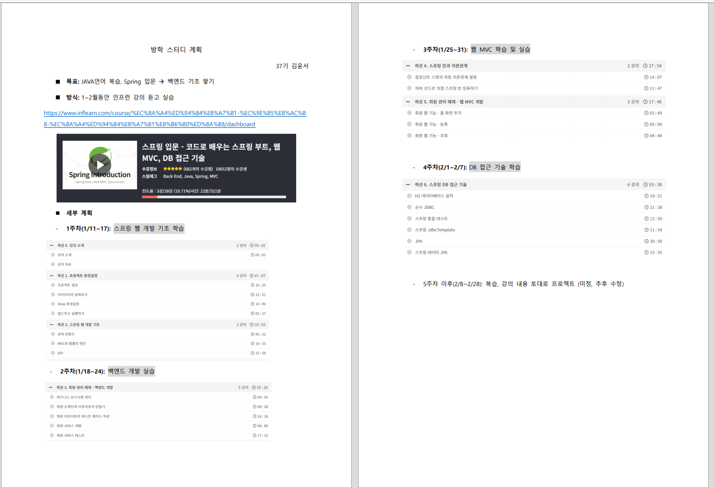

# springboot 입문

### 1주차
✅ 백엔드 기초, 스프링 프로젝트 환경설정

### 2주차
✅ **회원 관리 예제**   
✅ 복습   
⬜ 자바 컬렉션 개념 다시 공부하기   
✅ 자바 인터페이스, 클래스 내용 정리      

### 3주차
✅ **웹 MVC 개념 다시 정리**   
✅ 테스트 코드 연습   
✅ 복습   

### 4주차
✅ memberService 테스트 코드 작성(회원가입, 중복 회원 방지)   

### 5주차
✅ MVC 설계하기(회원 등록, 조회 기능)   
⬜ View 보완하기

### 6주차
✅ DB 연결   
✅ JdbcTemplate   
⬜ JPA -이건 좀 나중에 다시 봐야할 듯.   
⬜ AOP -나중에 다시.
- - -
### 스터디 계획

